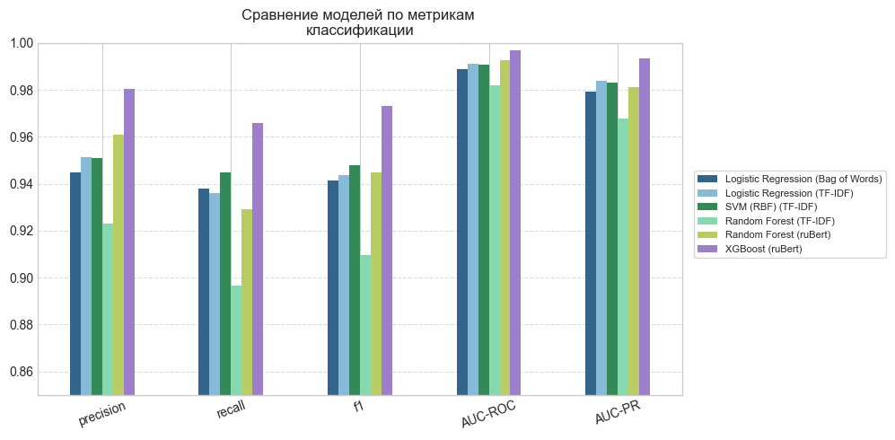

# Классификация текста на спам с использованием ruBERT и XGBoost

Репозиторий содержит исходный код и материалы курсовой работы на тему: **«Модель классификации спам-сообщений от ботов в Telegram»**.

В рамках проекта проводится сравнительный анализ классических подходов к векторизации текста (Bag of Words, TF-IDF) и современных контекстуальных эмбеддингов (ruBERT). Наилучшие результаты показала связка **XGBoost + ruBERT**, оптимизированная с помощью библиотеки Optuna. Итоговая модель интегрирована в Telegram-бота.

## Структура проекта

```text
├── datasets/              # Исходные и предобработанные датасеты
├── EDA.ipynb              # EDA: анализ данных, визуализация
├── models_training.ipynb  # векторизация и обучение моделей классификации

├── SpamBot/               # Код проекта телеграм-бота
│   ├── best_model/        # Сохраненные веса лучшей модели (XGBoost + ruBERT)
│   ├── bot.py             # Исходный код телеграм-бота
│   ├── db.py              # Реализация логики базы данных
│   ├── detector.py        # Вероятностное предсказание для сообщения 
│   ├── spam_bot.db        # База данных

├── .env.example           # Пример файла с переменными окружения (для бота)
└── README.md              # Описание репозитория
```

## Telegram-бот

Бот использует лучшую обученную модель для классификации текста в реальном времени.

### Настройка бота
1. Получите токен бота у [@BotFather](https://t.me/BotFather) в Telegram.
2. Создайте файл `.env` в корневой папке проекта (или скопируйте `.env.example`):
   ```env
   BOT_TOKEN = ваш_токен_от_BotFather
   ```
3. Запустите бота:
   ```bash
   python SpamBot/bot.py
   ```

## Основные результаты

В ходе экспериментов модель **XGBoost на эмбеддингах ruBERT** показала наилучшее и наиболее сбалансированное качество по всем метрикам:
* **Precision:** ~0.98
* **Recall:** ~0.97
* **F1-score:** ~0.97
* **AUC-ROC:** ~1.00
* **AUC-PR:** ~0.99



##  Стек технологий

* **Язык:** Python 3.12
* **NLP и эмбеддинги:** `torch` и `transformers` (Hugging Face): `RuModernBERT-base`, `scikit-learn`: `TF-IDF` и `Bag of Words`
* **Машинное обучение:** `scikit-learn`, `xgboost`
* **Оптимизация:** `Optuna`
* **Анализ данных:** `pandas`, `numpy`, `matplotlib`, `seaborn`
* **Telegram API:** `aiogram`

##  Авторство

Проект выполнен в рамках курсовой работы.

**Авторы:** Чукреева Елизавета Андреева и Белей Семён Сергеевич

**Год:** 2026

